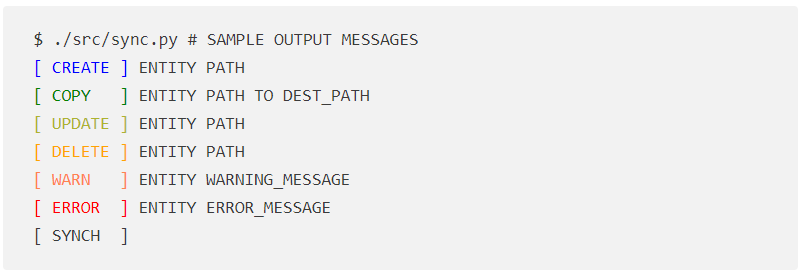

# Differential backup tool

[](https://www.python.org/downloads/release)
[](https://github.com/nierja/sync/blob/master/LICENSE)

## Overview

This project provides a simple differential backup tool written in Python. The tool performs one-way synchronization from a source directory to a replica directory, ensuring that the replica is an exact copy of the source. It is designed to handle various scenarios, such as new files in the source directory, modified files, and deleted files. The tool provides colored output messages in the command line interface (CLI), logs all operations to a log file, and can be configured to perform synchronization periodically at a specified time interval.

This project uses Python standard library modules only and doesn't rely on any third party libraries. I chose `argparse` for parsing command-line options and arguments. Library `filecmp` is the key module, used for file and directory comparisons. A comparison objects returned by calling `filecmp.dircmp(srcDir, dstDir)` is used to determine which files need to be copied, updated, or deleted. 

Python 3.10 or newer is required, as the code uses a `match-case` statement. It can however easily be refactored to use loner `if-elif-else` statement instead.

## Table of Contents

- [Features](#features)
- [Installation](#installation)
- [Usage](#usage)

## Features

- Differential backup: This tool performs one-way synchronization from a source directory to a replica directory. It ensures that the replica directory is an exact copy of the source by copying new files, updating modified files, and deleting files that no longer exist in the source directory. This way we save resources by avoiding rewriting the whole replica directory every time.
- Periodic synchronization: The tool can be configured to perform synchronization periodically at a specified time interval.
- Logging: All operations performed during the backup are logged into a log file. The log file includes timestamps and details about each operation.
- Colored CLI output: Different types of operations (e.g., copy, update, delete, warning, error) are printed in different color to make it easier to know what is happening (and how to debbug runtime errors).



<!---
 <pre>
 <code>$ ./src/sync.py # SAMPLE OUTPUT MESSAGES
 <span style="color:blue">[ CREATE ]</span> ENTITY PATH
 <span style="color:green">[ COPY   ]</span> ENTITY PATH TO DEST_PATH
 <span style="color:#aeb32e">[ UPDATE ]</span> ENTITY PATH
 <span style="color:orange">[ DELETE ]</span> ENTITY PATH 
 <span style="color:#ff834e">[ WARN   ]</span> ENTITY WARNING_MESSAGE
 <span style="color:red">[ ERROR  ]</span> ENTITY ERROR_MESSAGE
 [ SYNCH  ]</code>
 </pre>
-->


## Installation

1. Clone this repository and move into it. No third-party libraries required!

   ```bash
   git clone git@github.com:nierja/sync.git
   cd sync
   ```

2. Run unittests to make sure everything works.

   ```bash
   python -m unittest tests/test_sync.py
   ```

    This repository already contains a source directory `tests/sourceDir/` for testing purposes. Feel free to play around and try making a backup for this default directory by running

   ```bash
   python src/sync.py
   ```

## Usage

The `sync.py` script uses CLI arguments to customize its behavior. You can display the list of CLI arguments by running:

```shell
$ python src/sync.py --help
usage: sync.py [-h] [--source SOURCE] [--replica REPLICA] [--logDir LOGDIR]
               [--logFileName LOGFILENAME] [--syncPeriod SYNCPERIOD]

options:
  -h, --help            show this help message and exit
  --source SOURCE       Path to the source directory to be mirrored
  --replica REPLICA     Destinaton path of the backup (replica) directory
  --logDir LOGDIR       Directory where to store the log file
  --logFileName LOGFILENAME
                        Name of the log file
  --syncPeriod SYNCPERIOD
                        Time interval in seconds between periodic synchronizations
                        (backups)
```